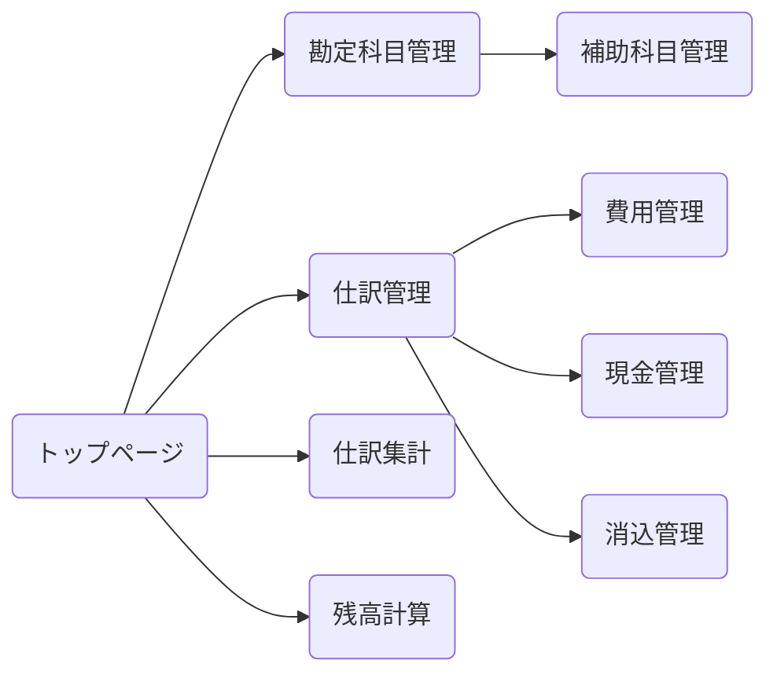

# 画面構成

```mermaid
flowchart LR

  a("トップページ")
  b("勘定科目管理")
  c("仕訳管理")
  d("補助科目管理")
  e("費用管理")
  f("現金管理")
  g("消込管理")
  h("仕訳集計")
  i("残高計算")

  a --> b
  a --> c
  b --> d
  c --> e
  c --> f
  c --> g
  a --> h
  a --> i
```
